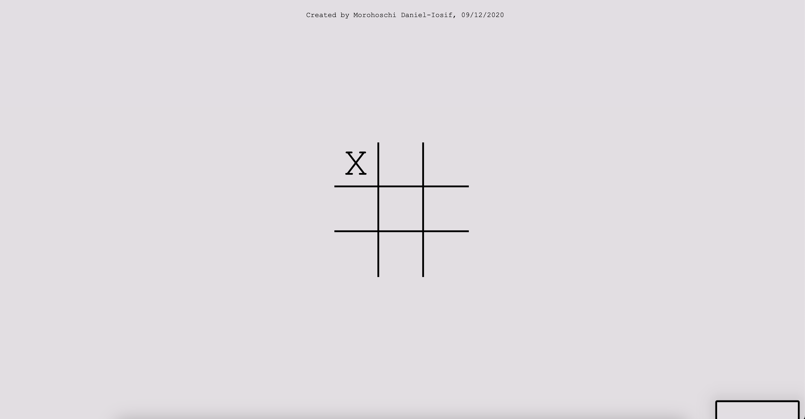

# ❌⭕ Tic Tac Toe Game ⭕❌

Welcome to the Tic Tac Toe game! 🚀 Challenge your friends in this classic two-player game of X's and O's. Can you get three in a row before your opponent?

## How to Play

1. Tic Tac Toe is played on a 3x3 grid.
2. Players take turns to place their symbol (X or O) in an empty cell.
3. The first player to get three of their symbols in a row (horizontally, vertically, or diagonally) wins.
4. If all cells are filled and no player has three in a row, the game ends in a draw.

## Try the Live Demo

Check out the live demo of the Tic Tac Toe game [here](https://morohoschidanieli.github.io/tic-tac-toe/). 🌐

## Screenshots

## Technologies Used

The Tic Tac Toe game is built using the following technologies:

- HTML, CSS, and JavaScript: For creating the user interface and game logic.
